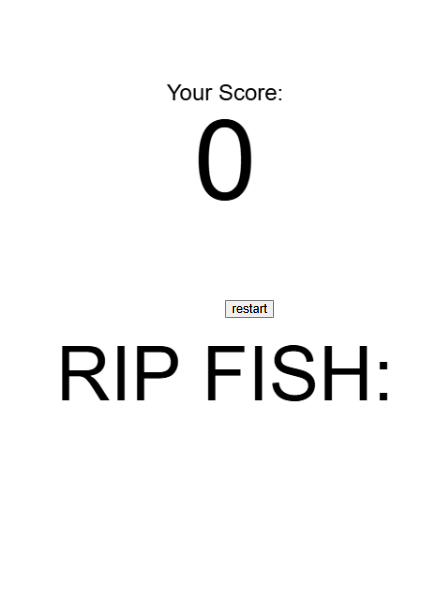

# Mini Project — Floppy Fish

---

### The Project
This project was made by Jacee and Isaac. We wanted to conceptualize flappy bird as a fish, as it gave us opportunity to play with the physics and artwork while still retaining the core mechanic of the game.

The original flappy bird had the pipe image reversed, but we wanted to explore in more depth on how image worked, so we chose stalagmites for the ceiling and corals at the bottom. All of the assets were made by Jacee.

We added in a start and home screen and an equivilant of a award/ point ranking system, instead of a medal, the player gets a fish pun as encouragement depending on the points scored.


---

### Output



<!-- Drop a screenshot or GIF of your finished project.
     Save it to a readme-assets/ folder inside this project folder.
     Got more than one good screenshot? Add them. -->

[Watch Online](https://your-link-here)

<!-- Replace the link above with a URL to a screen recording or video of your project.
     ⚠️ Make sure the file or page is set to public before submitting. -->

---

### ✍️ Reflection

<!-- 200–300 words on your process. Write freely — this isn't an essay.
     Some prompts to get you started:
     — What did you set out to make, and how did the result compare?
     — What inputs does your sketch respond to, and how did you approach that?
     — What was your biggest challenge, and how did you work through it?
     — What would you push further if you had more time? -->

---

<!-- ─────────────────────────────────────────────────────
     GOING FURTHER — want to document more? Try any of these:

     ### ✨ What I Changed
     A short list of the additions and modifications you made to the scaffold.
     - Changed the paddle to use mouse tracking instead of keyboard
     - Redesigned the visual language with a retro CRT aesthetic

     ### 🔍 Code Structure
     Briefly explain how your files are organised.
     - `sketch.js` — main game loop
     - `Ball.js` — ball class with collision logic
     - `assets/` — sprites and sounds

     ### 🧩 Something I'm Proud Of
     A snippet of code, a design decision, a moment where it clicked.
     ```js
     // your code here
     ```

     ### 🔗 References
     Anything that helped or inspired you — tutorials, artworks, tools.
     ───────────────────────────────────────────────────── -->
